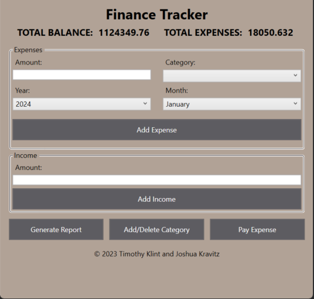
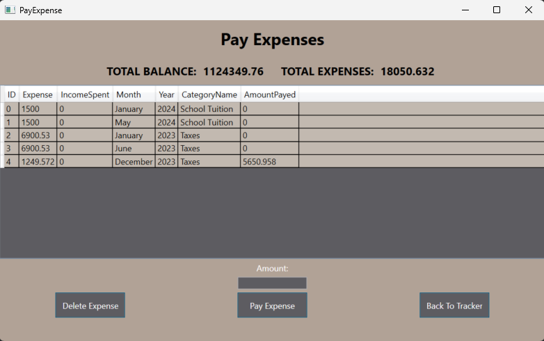

# Finance Tracker: Your Daily Money Manager 🚀

**Welcome to Finance Tracker, the ultimate tool for managing your personal finances effortlessly. Whether you're keeping track of a few bucks or managing a complex budget, our WPF application has got you covered!**

## 🌟 Features

- **💸 Expense Wizard:** Input expenses with details like category, amount, and date, and watch your budget update in real-time.
- **💰 Income Dashboard:** Add your earnings and see how your income stacks against your spending.
- **🗂️ Custom Categories:** Create bespoke categories for expenses that align with your lifestyle.
- **📊 Reports & Insights:** Generate slick reports, saved in handy `MONTH_YEAR_expenses.csv` files, for a crystal-clear financial picture.
- **💳 Pay Bills:** Seamlessly manage and track bill payments directly from the dashboard.

## 📸 Snapshots from the App



>*The main interface, log expenses and income!.*



> *Pay off your expenses, keeping track of all past expenses in a neat CSV.*

## 🛠 Installation Steps

1. **Clone the magic repository:**
   ```bash
   git clone https://github.com/yourgithubusername/finance-tracker.git
   ```
2. **Enter the realm of finance management:**
   ```bash
   cd finance-tracker
   ```
3. **Fire up the engine:**
   - Ensure Visual Studio is equipped with the C# sorcery.
   - Open the mystical solution file and let the build commence!

## 🎮 Getting Started

To get started:
- **Record an Expense:** Dance your way through the 'Expenses' section, sprinkle in the details, and hit 'Add Expense'.
- **Add some Income:** Got paid? Awesome! Fill in the 'Income' section and click 'Add Income'.
- **Organize Categories:** Mix and match your categories in the 'Add/Delete Category' tab like a pro.
- **Generate Reports:** Curious about your spending? Click 'Generate Report' for the revelations!

## 📜 License

This project is liberated under the MIT License. See the [LICENSE.md](LICENSE) scroll for more details.

---

**Join us in revolutionizing personal finance management. Because your coins deserve better!**
